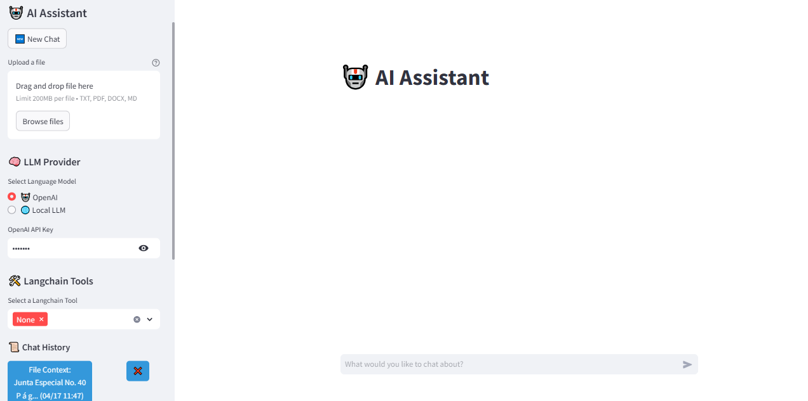

# 🤖 AI Assistant App

An intelligent assistant built with **LangChain**, **OpenAI**, and **Streamlit** that supports natural conversation, file-based summarization, and tool-augmented reasoning like web search and Wikipedia lookup.

---

## 🖼️ Demo




---

## 🚀 Features

* 💬 Chat with GPT-4 Mini (OpenAI) or local LLMs via Ollama
* 📄 Upload and analyze text, PDF, DOCX, or Markdown files
* 🛠️ Tool support via LangChain agents (e.g., SerpAPI, Wikipedia)
* 🧠 Uses context-aware memory from previous chat messages
* 🗃️ Chat history with timestamps, titles, and persistence
* 🔒 Secure API key input (OpenAI & SerpAPI)
* 🎯 Built-in summarization of large documents using `map_reduce`

---

## 📦 Tech Stack

| Tool                       | Description                            |
| -------------------------- | -------------------------------------- |
| `LangChain`                | Framework for chaining LLM and tools   |
| `Streamlit`                | Web frontend for interactive UI        |
| `OpenAI`                   | GPT-4 Mini API or local LLM via Ollama |
| `PDFPlumber`, `docx`, etc. | File parsing & pre-processing          |
| `LangChain Tools`          | Web search, Wikipedia, and more        |

---

## 🛠️ Setup Instructions

### 1. Clone the Repository

```bash
git clone https://github.com/yourusername/ai-assistant.git
cd ai-assistant
```

### 2. Install Dependencies

```bash
pip install -r requirements.txt
```

> Make sure you also have Ollama installed if using local models.

### 3. Run the App

```bash
streamlit run app.py
```

---

## 🔐 API Keys Required

Store your keys inside the app sidebar when prompted:

* **OpenAI API Key** — for GPT-4 Mini (`OPENAI_API_KEY`)
* **SerpAPI Key** — for web search support (`SERPAPI_API_KEY`)

---

## 📁 File Upload Support

You can upload `.txt`, `.pdf`, `.docx`, and `.md` files. Large files are automatically summarized using LangChain’s map-reduce summarization chain.

---

## ⚙️ Tools Available

| Tool                 | Description                     |
| -------------------- | ------------------------------- |
| Wikipedia            | Context search from Wikipedia   |
| Web Search (SerpAPI) | Real-time search via Google     |
| Web Page Loader      | (Optional) Extract webpage text |

Enable tools from the sidebar. More can be added via `ToolManager`.

---

## 💡 Future Improvements

* ✅ Vector store for long-term memory
* ✅ User authentication
* ✅ Chat export as Markdown or PDF
* ✅ Custom prompt templates
* ✅ Real-time voice support via TTS/ASR

---

## 👤 Author

**Asad Khan**
[GitHub](https://github.com/assad-khan) | [Fiverr](https://www.fiverr.com/s/dDB9epg) | [LinkedIn](https://linkedin.com)

---

## 📜 License

```
© 2025 Asad Khan. All rights reserved.

This project is not open for commercial use or redistribution without explicit permission from the author.

If you wish to use, modify, or distribute this software, please contact:

📧 asadpythondeveloper@gmail.com
```

---
